# Developing a Disassembly Tutorial

In this session you will:
- Collaborate in your groups to safely **disassemble a computer**.
- Develop a **disassembly tutorial** detailing each step and documenting the process sequentially with photos and descriptions.

## Disassembly & Assembly Tutorial Template:

Use the **Disassembly Process** section of the provided *Disassembly & Assembly Tutorial Template* to organize your work clearly and systematically.

```{suggestionnote}
**Important:** You will continue adding to this same template throughout the course. By the end, it will detail the disassembly process, hardware components and assembly process. Together, this will become the **final product**.
```

```{raw} html
<div style="text-align: center">
    <iframe src="https://docs.google.com/document/d/18J_qKyfmHlTXNZIo0ZqgH_LuOgD4V9fQ0w-TetFaJcc/edit?usp=sharing" width="100%" height="600px" frameborder="0"></iframe>
</div>
```

## Disassembly instructions

Disassembly breaks a device into separate parts.

Materials required:

- One working PC
- Anti-static wrist strap
- Anti-static mat
- Anti-static bags (various sizes)
- Technician’s toolkit
- Plastic cup or box to organize screws, nuts, bolts

Procedure:

| Step | Instructions |
|---|---|
| 1. Unplugging | ✓ Unplug the power cord from the PC. <br>✓ Unplug all the peripherals attached to the computer, such as the keyboard, mouse, monitor, headphones. |
| 2. Open the case | 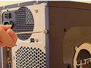 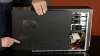 <br> First remove the screws of the left side cover and slide the side cover. |
| 3. Disconnect all the connectors | 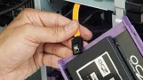 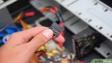 <br> Disconnect all the connectors connected to the motherboard. These include the SATA power cable and data cable of HDD, as well as the SATA cable of optical drive. |
| 4. Remove the fan | 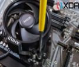 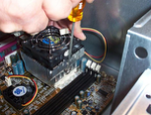 <br> Remove the fan now. |
| 5. Remove the power supply | 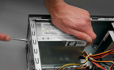 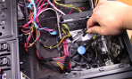 <br> Remove the power supply that is connected to the motherboard by a 20-pin connector and 4-pin connector. |
| 6. Remove HDD and optical drive | 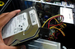 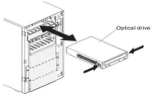 <br> Remove the SATA cable connected to the HDD and optical drive in the motherboard. |
| 7. Remove RAM modules | To remove the RAM: <br> 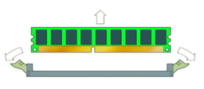|
| 8. Remove expansion cards | 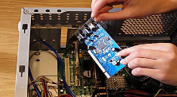 <br> To remove the expansion cards, disconnect the cables attached to it. |
| 9. Remove motherboard | 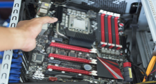 <br> To remove the motherboard, disconnect all the cables from the motherboard. |

