# Desenvolvendo um Tutorial de Montagem

Nesta sessão:
- Colabore para **montar um computador** com segurança
- Desenvolva um **tutorial de montagem** detalhando cada etapa e documentando o processo sequencialmente com fotos e descrições.
- Colabore em seus grupos para **montar um computador** com segurança.
- Desenvolva um **tutorial de montagem** detalhando cada etapa e documentando o processo sequencialmente com fotos e descrições.

## Modelo de Tutorial de Desmontagem e Montagem:

Utilize a seção **Processo de Montagem** do *Modelo de Tutorial de Desmontagem e Montagem* fornecido para organizar seu trabalho de forma clara e sistemática.

```{raw} html
<div style="text-align: center">
    <iframe src="https://docs.google.com/document/d/18J_qKyfmHlTXNZIo0ZqgH_LuOgD4V9fQ0w-TetFaJcc/edit?usp=sharing" width="100%" height="600px" frameborder="0"></iframe>
</div>
```

## Instruções de montagem

A montagem de computadores é um trabalho essencial do técnico de instalação de computadores. É um processo no qual todos os componentes internos necessários para o sistema de computador são encaixados para tornar o computador funcional. Existe uma sequência adequada de fixação para cada componente no sistema.

É um processo sistemático. Comece organizando as peças do computador.

Materiais necessários:

- Gabinete com fonte de alimentação instalada
- Placa-mãe
- CPU
- Conjunto dissipador de calor/ventilador
- Pasta térmica
- Módulo(s) de RAM
- Suportes e parafusos da placa-mãe
- Pulseira e tapete antiestáticos
- Kit de ferramentas

| Etapa | Instruções |
|---|---|
| 1. Abrir o gabinete | 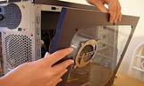 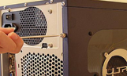 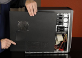 <br> O primeiro passo para montar um computador é abrir o gabinete. Para abrir o gabinete, primeiro remova os parafusos da tampa lateral esquerda e deslize a tampa lateral. |
| 2. Instalar a fonte de alimentação | 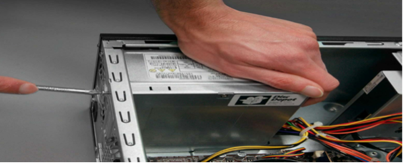 <br> O próximo passo é instalar a fonte de alimentação. Normalmente, há quatro parafusos que fixam a fonte ao gabinete. |
| 3. Fixar componentes na placa-mãe | 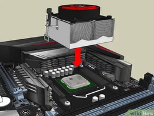 <br> A placa-mãe deve ser preparada antes da instalação. Para prepará-la, primeiro instale o processador (CPU), depois o dissipador de calor sobre a CPU e, em seguida, o ventilador da CPU. <br> <br> 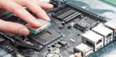 <br> CPU:<br> Um soquete de CPU usa uma série de pinos para conectar o processador da CPU à placa-mãe do PC. A CPU é conectada via soquete de CPU. <br> <br> 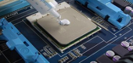 <br> Dissipador de calor e ventilador:<br> Um dissipador de calor e ventilador (HSF) é uma solução de resfriamento ativa usada para resfriar circuitos integrados em sistemas de computador, geralmente a Unidade Central de Processamento (CPU).<br> <br> 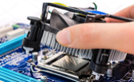 <br> Conecte o cabo de alimentação do conjunto ao conector do ventilador da CPU na placa-mãe. <br> <br> 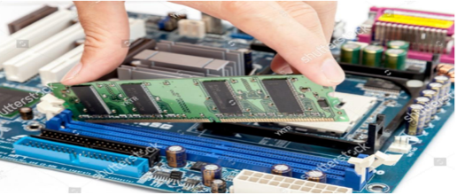 <br> Instalação da RAM: <br> Para instalar a RAM, primeiro instale-a na placa-mãe e depois fixe a placa-mãe no gabinete. Certifique-se da compatibilidade da RAM com a placa-mãe. |
| 4. Instalar a placa-mãe | 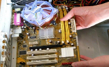 <br> Após preparar a placa-mãe, você pode instalá-la no gabinete do computador.|
| 5. Instalar as unidades internas | 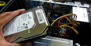 <br> Disco rígido - O disco rígido é o dispositivo que armazena todos os dados. Conecte o cabo de alimentação vindo da fonte ao conector de energia do disco rígido. Conecte o cabo de dados SATA do soquete do disco rígido ao soquete da placa-mãe. |
| 6. Conectar todos os cabos internos | 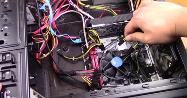 <br> Os cabos de alimentação são usados para distribuir eletricidade da fonte para a placa-mãe e outros componentes. Os cabos de dados transmitem dados entre a placa-mãe e os dispositivos de armazenamento, como discos rígidos. |
| 7. Instalar as conexões de energia da placa-mãe | 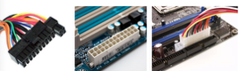 <br> O conector principal de energia ATX terá 20 ou 24 pinos. |
| 8. Conectar cabos externos | 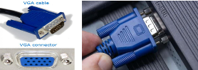 <br> Conectar o monitor - O cabo VGA é usado para conectar ao monitor. <br> <br>  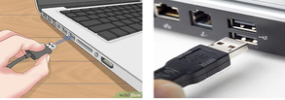 <br> Conectar o teclado - Se usar conector USB, conecte em qualquer porta USB na parte traseira do computador. <br> <br>  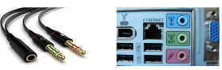 <br> Conectar fones de ouvido ou alto-falantes, e microfone - Conecte os alto-falantes externos ou fones de ouvido à porta de áudio do computador (na frente ou atrás do gabinete).<br> <br> 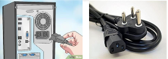 <br> Conectar o computador à fonte de alimentação - Conecte o cabo de alimentação na parte traseira do gabinete. <br> <br>  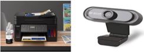 <br> Conectar impressora, scanner e webcam |
| 9. Ligar o computador | 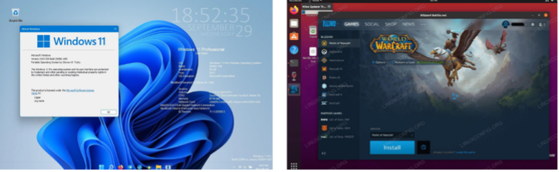 <br>Sempre lembre-se de que o primeiro passo é apertar o botão de energia da CPU e depois o do monitor. Um sistema operacional ou software de sistema como Windows ou Linux começará a carregar. Agora seu computador está pronto para uso. |

## Envie seu produto final

Revise o modelo preenchido em grupo, faça o download e envie-o no Google Classroom.

```{suggestionnote}
**Google Classroom????**
```

